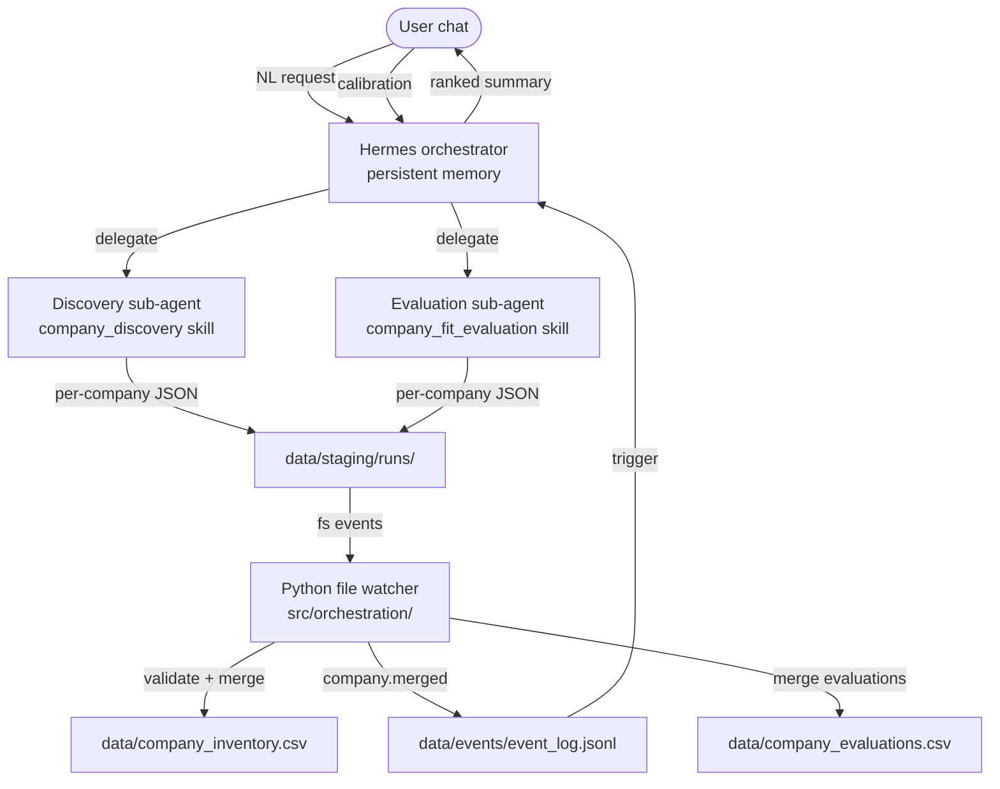

# PRD: Event-Driven Company Discovery & Evaluation Pipeline

**Status:** Draft  
**Date:** 2026-08-01  
**Owner:** Project maintainer  
**Related ADR:** [ADR-008](../adr/ADR-008-hermes-event-driven-orchestration.md)

---

## 1. Problem statement

Today, company discovery and fit evaluation are **documented workflows** but not **connected automation**. An agent can stage JSON, but Python does not ingest it. The user must run CLIs manually, switch contexts, and cannot request "find 50 AI health companies" in one conversational session and receive ranked evaluations with reasoning.

The desired experience: tell **Hermes** what kinds of companies to find; Hermes uses persistent memory of preferences; companies are discovered, validated, merged to inventory, evaluated, and presented for calibration — all in one chat.

---

## 2. Goals & non-goals

### Goals

| ID | Goal |
|----|------|
| G1 | Natural-language discovery requests with preference-aware source selection |
| G2 | Per-company staging with immediate schema validation |
| G3 | Automatic merge to `data/company_inventory.csv` on valid staging |
| G4 | Evaluation sub-agent triggered on each new inventory company |
| G5 | Single chat output: discovered companies, scores, ranking, reasoning |
| G6 | User calibration loop that updates Hermes memory and project preference files |
| G7 | Preserve ADR-002: agents never write canonical data directly |

### Non-goals (this PRD)

- Job discovery and job fit automation (Phase 5+; skills exist, not wired)
- Replacing Ollama batch scorer entirely (ADR-006 fallback remains)
- Multi-user or cloud deployment
- Resume tailoring

---

## 3. User stories

### US-1: Discovery request

> As a job seeker, I tell Hermes: *"Find 50 undiscovered companies in Montreal AI health — Series A–C, not already in my inventory."*  
> Hermes reads my profile, checks inventory for duplicates, searches configured sources and the open web, and stages candidates with required fields.

**Acceptance criteria:**

- Hermes parses count, geography, industry, and stage from the request (or asks one clarifying question).
- Each candidate has `company_name`, `website`, `source_id`, `source_name`, `source_url`, `confidence`, `notes`.
- Duplicates against inventory are skipped before staging.
- Evidence saved to `data/source_evidence/<run_id>/`.

### US-2: Incremental validation

> As the system, when a discovery sub-agent writes one candidate file, I validate it immediately against `CompanyCandidate` and log pass/fail.

**Acceptance criteria:**

- Invalid files moved to `rejected/` with `.error.json` sidecar.
- Valid files emit `candidate.staged` event.
- Merge handler attempts inventory insert; on success emits `company.merged`.

### US-3: Automatic evaluation

> As the system, when a company is merged to inventory, I trigger the evaluation sub-agent to score it against my profile.

**Acceptance criteria:**

- Evaluation sub-agent receives `company_id`, `company_name`, `website`, and profile files.
- Output validates against `CompanyFitResult` (0–10 scores, numeric confidence).
- On merge, `evaluation.merged` event fires; run manifest updated.

### US-4: Chat summary & calibration

> As a job seeker, after the run I see a ranked list with reasoning and can correct scores or explain what matters more.

**Acceptance criteria:**

- Hermes presents markdown table: rank, company, fit_score, top factors, red flags.
- User corrections written to `calibration.json` for the run.
- On explicit "apply preferences", Hermes updates `user/agent_calibration.md` and/or `config/profile.yml` preferences.
- Hermes persistent memory records calibration themes for future runs.

---

## 4. Actors & components



| Component | Responsibility |
|-----------|----------------|
| **Hermes** | Parse requests; load memory + profile; spawn sub-agents; aggregate results; handle calibration |
| **Discovery sub-agent** | Source selection; web/directory research; per-company staging; evidence |
| **Evaluation sub-agent** | Company research; `CompanyFitResult` staging; optional markdown report |
| **Run manifest** | `data/staging/runs/<run_id>/manifest.json` — request params, status, counts |
| **Staging watcher** | Validate, merge, emit events, update manifest |
| **Event log** | Append-only audit trail for automations |

---

## 5. Data model extensions

### 5.1 Run manifest

`data/staging/runs/<run_id>/manifest.json`:

```json
{
  "run_id": "20260801T183000Z",
  "type": "company_discovery_evaluation",
  "requested_by": "hermes",
  "request": {
    "count": 50,
    "industries": ["AI", "healthcare"],
    "locations": ["Montreal", "Canada", "Remote"],
    "exclude_existing": true,
    "notes": "Series A-C preferred"
  },
  "status": "running",
  "counts": {
    "candidates_staged": 0,
    "candidates_merged": 0,
    "candidates_rejected": 0,
    "evaluations_staged": 0,
    "evaluations_merged": 0
  },
  "started_at": "2026-08-01T18:30:00Z",
  "completed_at": null
}
```

### 5.2 Per-company candidate file

`data/staging/runs/<run_id>/company_candidates/<slug>.json` — single `CompanyCandidate` object (not array).

### 5.3 Per-company evaluation file

`data/staging/runs/<run_id>/company_evaluations/<slug>.json` — single `CompanyFitResult` object.

### 5.4 Calibration file

`data/staging/runs/<run_id>/calibration.json`:

```json
{
  "corrections": [
    {
      "company_name": "Acme Health AI",
      "original_fit_score": 8.0,
      "corrected_fit_score": 6.5,
      "feedback": "Too much weight on funding; they are services-heavy not product."
    }
  ],
  "preference_updates": [
    "Prefer product companies over consulting shops",
    "Weight mission_alignment higher for early-stage"
  ],
  "applied_to_profile": false
}
```

### 5.5 Agent-writable preference files

| Path | Writer | Purpose |
|------|--------|---------|
| `user/agent_calibration.md` | Hermes (append) | Durable calibration notes from chat |
| `config/profile.yml` → `preferences` | Hermes with user confirm | Canonical preference updates |
| Hermes memory (external) | Hermes | Cross-session recall |

Human-owned files (`user/master_cv.md`, etc.) are not auto-edited.

---

## 6. Event specification

Events append to `data/events/event_log.jsonl` (one JSON object per line).

```json
{
  "event_id": "uuid",
  "type": "company.merged",
  "run_id": "20260801T183000Z",
  "timestamp": "2026-08-01T18:35:12Z",
  "payload": {
    "company_id": 274,
    "company_name": "Acme Health AI",
    "staging_path": "data/staging/runs/.../company_candidates/acme-health-ai.json"
  }
}
```

### Handler chain

```
candidate file created
  → validate CompanyCandidate
  → if invalid: reject + log
  → if valid: emit candidate.staged
  → merge to inventory (update_inventory)
  → if duplicate: skip + log
  → if inserted: emit company.merged

evaluation file created (after company.merged processed)
  → validate CompanyFitResult
  → merge to data/company_evaluations.csv
  → emit evaluation.merged
  → update manifest counts

when counts match request or timeout:
  → emit run.completed
  → Hermes presents chat summary
```

---

## 7. Hermes orchestrator behavior

### 7.1 Startup reads

1. `user/career_profile.md`, `user/proof_points.md`, `config/profile.yml`
2. `data/company_inventory.csv` (duplicate check)
3. `config/sources.yml`, `config/directory_sources.yaml`
4. Hermes persistent memory (prior calibrations, source preferences)
5. `user/agent_calibration.md` if present

### 7.2 Request parsing

Extract from NL:

- **count** (default 20)
- **industries** (default from profile)
- **locations** (default from profile)
- **source hints** ("from Life Sciences BC", "web only")
- **exclusions** ("not consulting", "no academia")

Create `run_id`, write manifest with `status: running`, tell user the run ID.

### 7.3 Sub-agent delegation

**Discovery:** Pass run_id, target count, filters, inventory domain set. Sub-agent writes per-company files and updates manifest counts periodically.

**Evaluation:** On each `company.merged` event (batched if needed), pass company context + profile. Sub-agent writes evaluation file.

### 7.4 Chat output format

```markdown
## Discovery run 20260801T183000Z — complete

**Requested:** 50 AI/healthcare companies (Montreal, Canada, Remote)  
**Results:** 48 staged · 42 merged · 6 duplicates skipped · 3 rejected (validation)

### Ranked companies

| # | Company | Fit | Industry | Mission | Career | Notes |
|---|---------|-----|----------|---------|--------|-------|
| 1 | Acme Health AI | 8.2 | 9 | 8 | 8 | PyTorch imaging stack |
| 2 | ... | | | | | |

### Top pick reasoning
...

### Red flags to watch
...

**Calibrate:** Tell me if any score feels wrong, or what to weight differently next time.
```

### 7.5 Calibration handling

- Score corrections → `calibration.json`
- Thematic feedback → Hermes memory + `user/agent_calibration.md`
- If user says "update my profile" → propose diff to `config/profile.yml` preferences for confirmation

---

## 8. Implementation plan

### Phase 1 — Staging infrastructure (foundation) ✅

**Status:** Implemented (2026-08-01)

| Task | Deliverable |
|------|-------------|
| 1.1 | Extend `load_staging_file` to accept single-object JSON files |
| 1.2 | `src/validators/merge.py` — `merge_company_candidate(path)`, `merge_company_evaluation(path)` |
| 1.3 | `data/company_evaluations.csv` writer with full `CompanyFitResult` columns |
| 1.4 | CLI: `python -m src.validators.merge --file <path>` and `--run <run_id>` |
| 1.5 | Update `DATA_CONTRACT.md` with per-record paths |
| 1.6 | Fix `skills/company_fit_evaluation` examples; delete/fix invalid sample staging file |

### Phase 2 — Event bus & watcher ✅

**Status:** Implemented (2026-08-01)

| Task | Deliverable |
|------|-------------|
| 2.1 | `src/orchestration/events.py` — event types, `emit()`, `read_since()` |
| 2.2 | `src/orchestration/watch_staging.py` — watchdog on `data/staging/runs/` |
| 2.3 | Run manifest CRUD helpers |
| 2.4 | `rejected/` handling with error sidecars |
| 2.5 | CLI: `python -m src.orchestration.watch_staging` (long-running) |
| 2.6 | Log merges to SQLite `runs` table |

### Phase 3 — Hermes skills & poll loop 🚧

**Status:** In progress

| Task | Deliverable |
|------|-------------|
| 3.1 | `skills/hermes_orchestrator/SKILL.md` — request parsing, **event log poll loop**, output format |
| 3.2 | Update `company_discovery` skill for per-record staging + manifest updates |
| 3.3 | Update `company_fit_evaluation` for event-triggered single-company mode |
| 3.4 | ~~Cursor Automation on `company.merged`~~ **Dropped** — Hermes polls event log (ADR-008) |
| 3.5 | `user/agent_calibration.md` template |
| 3.6 | Calibration writer in orchestrator skill |

### Phase 4 — Preference learning & polish ✅

**Status:** Implemented (2026-08-01)

| Task | Deliverable |
|------|-------------|
| 4.1 | `calibration.json` schema + merge into evaluation records |
| 4.2 | [Hermes memory sync guide](../guides/hermes-memory-sync.md) |
| 4.3 | Profile update flow with `--confirm` (`calibration_cli apply-profile`) |
| 4.4 | Dashboard **Company Fit** page reads `data/company_evaluations.csv` + latest run |
| 4.5 | Integration test: `tests/test_pipeline_integration.py` |

**Exit criteria:** User correction in chat → `calibration.json` → canonical CSV + `agent_calibration.md` (confirmed).

### Phase 5 — Extend pipeline (future)

- `company.evaluated` above `min_company_fit_score` → job discovery sub-agent
- Ranking CLI consuming evaluations
- `job.merged` / `job.evaluated` events (same pattern)

---

## 9. Technical dependencies

| Dependency | Purpose |
|------------|---------|
| `watchdog` (Python) | File system events for staging watcher |
| Hermes persistent memory | Cross-session preferences |
| Event log poll loop (Hermes) | Serial evaluation trigger — see ADR-008 |
| Existing: `update_inventory`, `load_staging_file`, skills | Core merge and agent logic |

---

## 10. Success metrics

| Metric | Target |
|--------|--------|
| Time from NL request to ranked output | < 30 min for 50 companies (network-dependent) |
| Validation rejection rate | < 5% with updated skills |
| Duplicate merge attempts | 0 new duplicates in inventory |
| User calibration captured | 100% of explicit corrections persisted |
| Manual CLI steps per run | 0 (watcher always on during active development) |

---

## 11. Risks & mitigations

| Risk | Mitigation |
|------|------------|
| Watcher not running | Document dev workflow; optional launchd/cron; manifest shows `staged` but not `merged` |
| Hermes memory diverges from repo | Periodic sync to `agent_calibration.md`; profile updates require confirm |
| Rate limits on web sources | Sleep between requests; reuse directory Python scraper for bulk |
| Evaluation quality | User calibration loop; evidence in `source_evidence/` |
| Schema drift | ADR-003 enforcement at merge; reject bad files early |

---

## 12. Decisions (resolved 2026-08-01)

| Question | Decision |
|----------|----------|
| **Trigger mechanism** | Hybrid: Python appends `data/events/event_log.jsonl`; Hermes polls in active chat (not Cursor Automation). See ADR-008. |
| **Evaluation concurrency** | **Serial** — one company per dequeue. |
| **Re-evaluation** | **Skip** if `data/company_evaluations.csv` already has the company; only re-eval when user explicitly asks (`force_re_eval`). |
| **Watcher deployment** | Start watcher at beginning of Hermes run (`python -m src.orchestration.watch_staging`); optional always-on for dev. |

---

## 13. Document maintenance

- Update this PRD when scope changes.
- Record architecture choices in [docs/adr/](../adr/).
- ADR-008 status: **Accepted** (2026-08-01).
